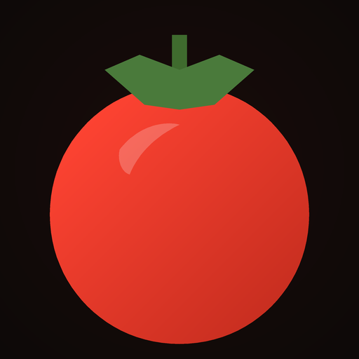
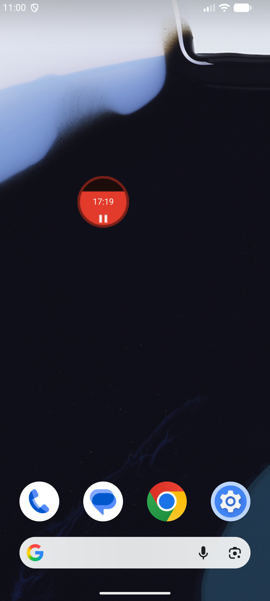
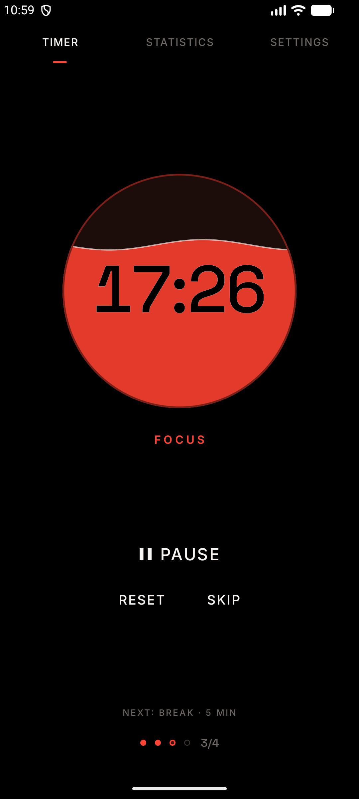
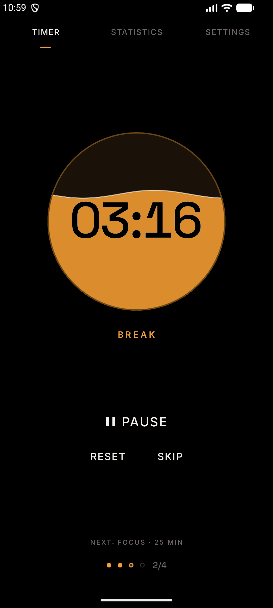
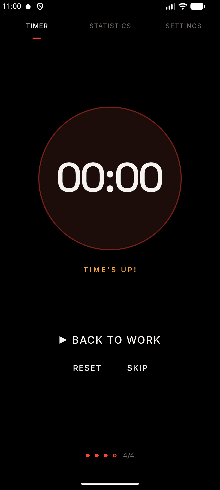
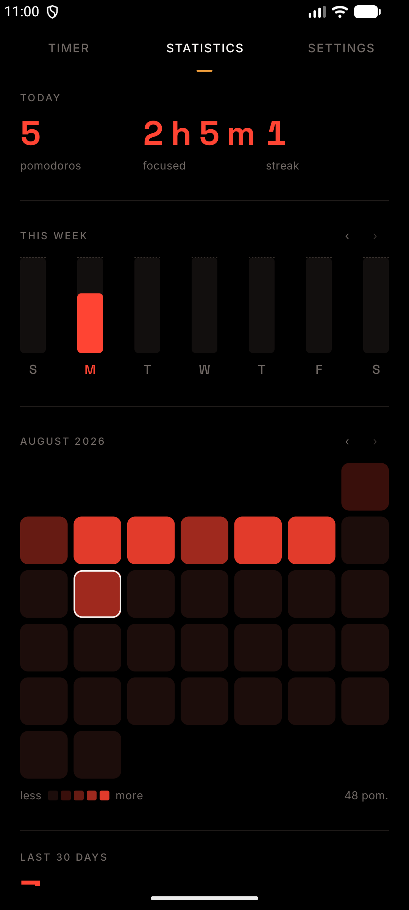
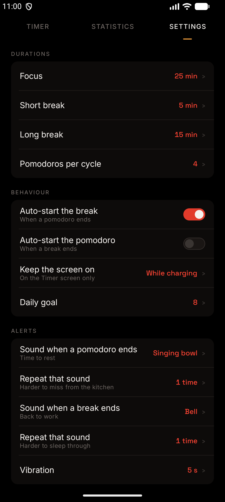

# ¡Aquí hay tomate! — Pomodoro timer for Android

<p align="center">
  
</p>

<p align="center">
  <strong>A Pomodoro timer with a one-cell home screen widget. Dark, red, and out of your way.</strong>
</p>

<p align="center">
  <a href="https://play.google.com/store/apps/details?id=com.jjrapps.aquihaytomate">
    
  </a>
</p>

<p align="center">
  
  
  
  
  
  
</p>

---

## Overview

Every Pomodoro app ships a 2×2 widget at minimum, and it eats your home screen. **¡Aquí hay tomate!**
ships a widget that fits in a **single cell**: tap to start or pause, double-tap to reset — without ever
opening the app.

Work for 25 minutes, rest for 5, and take a long break every four Pomodoros. Or set it up however you
like: every duration is yours. It fires on the right second with the screen off, after you swipe the
app away, and after a reboot — because a timer that runs late is no timer at all.

No accounts. No cloud. No ads. No tracking. All your data stays on your phone.

> The name is a Spanish pun: *pomodoro* is Italian for tomato, which is where the technique's name comes
> from. And yes, "¡Aquí hay tomate!" also nods to an old tinned-tomato commercial.

---

## 📸 Screenshots

<p align="center">
  
  
  
</p>
<p align="center">
  
  
  
</p>

---

## ✨ Features

### 🍅 One-cell home screen widget
- Occupies a **single home screen cell** (1×1) — the reason this app exists.
- **Tap** to start, pause or resume. **Double-tap** to reset.
- Shows the remaining time and drains like liquid as the slot progresses. Focus is red, breaks are amber.
- When a slot ends it shows the next one ready to go, never an alarm sign.
- The countdown ticks inside the launcher's process, so it costs nothing in battery.

### ⏱️ A timer that never fails
- Fires on the right second with the **screen off**, after the app is **swiped away**, and after a
  **reboot**.
- Changing the system clock does not make the Pomodoro jump.
- Built on persisted state, a foreground service and an `AlarmManager` backstop — three layers, so one
  can fail without you noticing.

### 🔁 Full Pomodoro cycles
- Focus, short break, and a long break every N Pomodoros.
- Every duration configurable: focus (1–180 min), short break (1–60), long break (1–120), and
  Pomodoros per cycle (2–12).
- Auto-start the break after a Pomodoro (on by default) and, optionally, the next Pomodoro after a break.
- The cycle belongs to the day: a new day starts a fresh cycle.
- Start, pause, reset and skip from the screen or the notification.

### 🔔 Alerts you can tell apart
- Five end-of-slot sounds — bell, Tibetan bowl, digital, soft, or silence — **one setting for each end of
  the slot**, so finishing a Pomodoro doesn't sound like finishing a break.
- Repeat the sound 1–10 times in a row, so you hear it from the next room.
- **Vibration duration configurable in seconds** (5 s by default, up to 30 s).
- Plays on the alarm volume and respects silent mode and Do Not Disturb.
- The end-of-slot notification reaches your paired **smartwatch**, with actions to start the next slot
  or dismiss.

### 📊 Statistics
- Pomodoros completed and time focused today.
- Weekly bars with your daily goal, monthly heatmap, and a 30-day trend.
- Current streak and best streak.
- Every chart hand-drawn with Compose `Canvas` — no charting library, no third-party analytics.

### 🌙 Everything else
- Keep the screen on: never, while charging (default), or always.
- A distinctive design: pure black background, tomato red accent, text controls instead of giant buttons.
- Dark theme only, on purpose.
- Spanish and English, switchable in the app.
- Guided onboarding that sets up your cycle, alerts and permissions before the first Pomodoro.

### 🔒 100% offline & private
- The app does not even declare the `INTERNET` permission.
- Zero telemetry, zero analytics, zero advertising SDKs, no account required.
- [Privacy policy](https://jorgejiro.es/apps/aqui-hay-tomate/privacidad/).

---

## 📱 Download

<p align="center">
  <a href="https://play.google.com/store/apps/details?id=com.jjrapps.aquihaytomate">
    
  </a>
</p>

<p align="center">
  
  <br />
  <sub>Scan with your phone's camera to open the Google Play listing.</sub>
</p>

| | |
| :--- | :--- |
| **Google Play** | [`com.jjrapps.aquihaytomate`](https://play.google.com/store/apps/details?id=com.jjrapps.aquihaytomate) |
| **Latest version** | 1.4.0 — see [`CHANGELOG.md`](CHANGELOG.md) |
| **Requires** | Android 12 (API 31) or newer |
| **Price** | Free, no ads, no in-app purchases |

After installing, long-press an empty spot on your home screen → **Widgets** → **¡Aquí hay tomate!** and
drop it into a single cell.

---

## 🛠 Tech Stack & Architecture

| Layer | Choice |
| :--- | :--- |
| Language | [Kotlin](https://kotlinlang.org/) (100%) |
| UI | [Jetpack Compose](https://developer.android.com/jetpack/compose), custom dark theme on top of Material 3 components |
| Architecture | MVVM + Unidirectional Data Flow, `ui` / `domain` / `data` layers |
| DI | Hilt |
| Storage | Room (focus history) + DataStore Preferences (settings and timer state) |
| Timer engine | Persisted state + `specialUse` foreground service + `AlarmManager` backstop |
| Widget | Classic `RemoteViews` with a native `Chronometer` (no Glance) |
| Charts | Compose `Canvas`, hand-rolled |
| Fonts | Inter + Space Grotesk, bundled as variable fonts (SIL OFL 1.1) |
| Tests | JUnit 4, MockK, Turbine, Compose UI Test, Room testing |
| Build | Gradle Kotlin DSL + Version Catalog, KSP |

---

## 🚀 Building from Source

### Prerequisites
- **Android Studio** with **JDK 21**
- **Android SDK**: compile SDK 36, min SDK 31

### Clone & Build
```bash
git clone https://github.com/jorgejiro/aquihaytomate-pomodoro-android.git
cd aquihaytomate-pomodoro-android

# Debug build
./gradlew assembleDebug

# Lint and unit tests
./gradlew lint test
```

Release builds are signed from Bitwarden Secrets Manager when `con-claves` injects
`AQUIHAYTOMATE_KEYSTORE_B64` (base64 of the `.jks`), `AQUIHAYTOMATE_STORE_PASSWORD`,
`AQUIHAYTOMATE_KEY_ALIAS` and `AQUIHAYTOMATE_KEY_PASSWORD`; the keystore is decoded into
`app/build/signing/`:

```bash
con-claves './gradlew :app:assembleRelease'
```

No local copy of the keystore is kept, so any machine with access to the secrets can build a
release. Without those variables they fall back to a `keystore.properties` at the repo root
(git-ignored, never committed):

```properties
storeFile=../aquihaytomate-release.jks
storePassword=…
keyAlias=aquihaytomate
keyPassword=…
```

With neither, the release build is left unsigned and debug builds are unaffected.

---

## 📂 Project Structure

```
├── app/
│   ├── schemas/                  # Exported Room schemas, versioned in git
│   └── src/main/java/com/jjrapps/aquihaytomate/
│       ├── data/                 # Room, DataStore, repositories
│       ├── domain/               # Models, use cases and pure logic (timer math, slot planner, stats)
│       ├── timer/                # Foreground service, alarm backstop, receivers, notifications
│       ├── alert/                # Sound and vibration player
│       ├── widget/               # 1×1 RemoteViews widget and its bitmap renderer
│       ├── ui/                   # Compose screens: timer, stats, settings, onboarding, changelog
│       └── di/                   # Hilt modules
├── docs/
│   ├── decisions/                # Architecture decision records
│   ├── design-spec.md            # Full visual specification
│   └── store-assets/             # Play Store icon, feature graphic and screenshots
├── gradle/libs.versions.toml     # Version Catalog
├── CHANGELOG.md
└── CLAUDE.md                     # Project guide: stack, conventions, architecture, roadmap
```

---

## 📚 Documentation

- [`CLAUDE.md`](CLAUDE.md) — project guide: stack, conventions, architecture, roadmap.
- [`docs/design-spec.md`](docs/design-spec.md) — full visual specification.
- [`docs/decisions/`](docs/decisions/) — architecture decision records.
- [`docs/play-store-publication-texts.md`](docs/play-store-publication-texts.md) — store listing and
  release checklist.

---

## 📄 License

This project is open-source under the [MIT License](LICENSE).

Bundled fonts (Inter, Space Grotesk) are licensed under the SIL Open Font License 1.1; see
[`app/src/main/res/raw/licenses_ofl.txt`](app/src/main/res/raw/licenses_ofl.txt).
