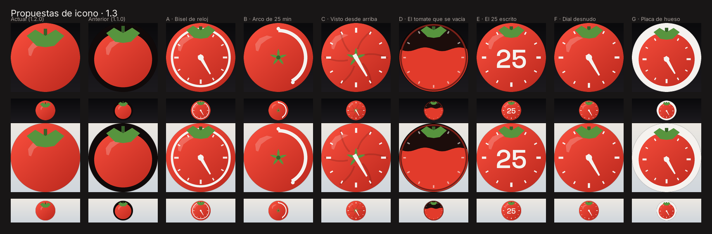

# Propuestas de icono · 1.3

Siete direcciones para el icono del launcher, renderizadas con las máscaras y los tamaños reales.
Nada de esto está decidido: es material para elegir. Las genera
[`generar-propuestas.py`](generar-propuestas.py) y se pueden volver a sacar con cualquier ajuste.

```
python3 docs/propuestas-icono/generar-propuestas.py
```

Cada propuesta se dibuja en el lienzo de 108 unidades del icono adaptativo y se muestra recortada con
la **máscara círculo** (Pixel Launcher) y con la **squircle** (One UI, Nova), a 216 px y **a 48 px**,
sobre fondo de pantalla oscuro y claro. Las dos primeras columnas son los controles: el icono publicado
y el de la 1.1.0.



---

## 1. Qué falla en el icono actual

El de la 1.2.0 arregló un problema real y creó otro.

Hasta la 1.1.0 el fondo era una placa casi negra con el tomate dibujado pequeño dentro. Sobre un fondo
de pantalla claro eso se leía como una pegatina negra, porque el launcher **siempre** pinta la capa de
fondo. La solución fue hacer que el fondo *fuera* la fruta: el degradado rojo llena los 108 dp y la
máscara del launcher es la que da la forma redonda.

Y ahí está la pérdida. **La silueta del tomate ya no la dibuja el icono, la dibuja el recorte.** No hay
contorno porque no hay nada que lo trace: el rojo llega hasta el filo. Lo que queda es un círculo rojo
con tres hojas encima, y de ahí la sensación de que «no se acaba de apreciar el tomate y sus bordes».

Comparado con Tomato, la diferencia no es que ellos tengan el fondo blanco. Es que **ellos dibujan el
contorno de la fruta y nosotros no**. El fondo blanco es solo lo que hace visible ese contorno.

A eso se suma lo segundo que planteas, y que es independiente: el icono no dice en ningún momento que
la app sea un temporizador.

## 2. Qué enseñan las tres referencias

| Referencia | Lo que hace | Lo que nos sirve |
|---|---|---|
| [zetabitapps](https://play.google.com/store/apps/details?id=com.zetabitapps.pomodoro) | Un temporizador de cocina ilustrado, con el dial de minutos rotulado 15–35 y volumen pintado | Confirma que «tomate + dial» es el idioma del género. El nivel de detalle no sobrevive a 48 px |
| [superelement](https://play.google.com/store/apps/details?id=com.superelement.pomodoro) | Renuncia al tomate: marcas en forma de semilla, un check en medio y degradado naranja a sangre | El contraejemplo. Tiene exactamente nuestro problema de borde y lo asume |
| [indieappslab](https://play.google.com/store/apps/details?id=io.github.indieappslab.pomodoro) | Aro grueso con degradado verde→naranja→rojo, dial de marcas dentro y **una sola aguja** | El hallazgo: **el contorno del tomate no es una silueta de fruta, es el bisel de un reloj**. Cierra la forma *por dentro*, así que funciona sobre cualquier fondo sin necesitar placa |

Ese es el truco que hay que robar —la idea, no el dibujo—: si el borde se traza dentro del icono, ya no
importa de qué color sea el fondo de pantalla. Y de paso, el bisel *es* la referencia al temporizador.
Un solo elemento resuelve las dos cosas.

De la tercera también vale la pena el gesto del degradado del aro, de verde a rojo: un tomate madurando.

## 3. Sobre el minuto 25

En un dial de 60 minutos el 25 cae a 150° del norte, o sea **apuntando hacia las cinco**. Es lo correcto
y así va en A, C, F y G.

El efecto secundario es que, leído como reloj de horas, eso son «las 5» y no «25 minutos». Tres maneras
de salir del paso, y las tres están sobre la mesa:

- **Dejarla ahí** (A, C, F). Es lo honesto; nadie mide un pomodoro leyendo el icono.
- **Colorear el tramo** en vez de señalar un instante (B): el arco cubre los 25 primeros minutos.
- **Escribirlo** (E): `25` en Space Grotesk, sin lugar a interpretación.

## 4. Las siete propuestas

Cada enlace abre la lámina con los cuatro recortes y las dos tiras a 48 px.

### [A · Bisel de reloj](A-bisel.png)

La vía de indieappslab con nuestra paleta. El rojo sigue llenando el lienzo —no volvemos a la placa— y
dentro va un aro de hueso de 2,4 unidades con las marcas de los cinco minutos y una aguja en el 25. El
cáliz se apoya arriba y corta el aro, que es lo que evita que parezca un reloj de pared.

**A favor:** es la que se lee antes como temporizador; el aro devuelve el borde perdido.
**En contra:** mete bastante hueso en el escritorio y el aro es, técnicamente, una caja alrededor de
algo — justo lo que el design-spec pide no hacer.

### [B · Arco de 25 minutos](B-arco.png)

Sin aguja y sin marcas: solo el arco de hueso cubriendo los 25 primeros minutos sobre el rojo, y el
cáliz en el centro porque la fruta se mira desde arriba.

**A favor:** la más sobria de las siete y la única que dice *cuánto*, que es lo que hace la app.
**En contra:** a 48 px se lee como un icono de recarga, no como un tomate. El cáliz central se pierde.
Es la más elegante en grande y la más débil en pequeño, y en el escritorio manda el pequeño.

### [C · Visto desde arriba](C-desde-arriba.png)

El tomate y la esfera son la misma forma: el cáliz cae en el centro, que es exactamente donde va el eje
de las agujas, los surcos de la fruta hacen de gajos y la única aguja marca el 25.

**A favor:** la idea más propia de las siete; no ilustra un tomate *y* un reloj, es una sola forma leída
de dos maneras.
**En contra:** el centro se empasta —aguja sobre cáliz sobre remache— y en monocromo el verde se
convierte en blanco y desaparece la mitad del chiste.

### [D · El tomate que se vacía](D-se-vacia.png)

El icono es el elemento de la pantalla principal: el círculo con el líquido a media altura y la
superficie ondulando.

**A favor:** es la app, literalmente. Ninguna otra propuesta enseña lo que vas a ver al abrirla.
**En contra:** para que el hueco vacío se vea oscuro hace falta fondo oscuro, así que **vuelve la placa
negra** y con ella el problema de la 1.1.0. Mírala sobre el fondo claro de la lámina.

### [E · El 25 escrito](E-cocina.png)

Marcas de minuto y `25` en Space Grotesk en el centro.

**A favor:** con diferencia la más legible a 48 px, y la única que no admite interpretación.
**En contra:** el icono se casa con un ajuste que el usuario puede cambiar en Ajustes, y una cifra
dentro del icono es lo más parecido a texto en una imagen que se puede hacer.

### [F · Dial desnudo](F-dial-desnudo.png)

Lo mismo que A **sin el aro**: marcas y aguja pintadas directamente sobre la fruta, y el cáliz arriba,
donde le toca.

**A favor:** el mejor equilibrio. Se lee tomate, se lee reloj, aguanta los 48 px, el monocromo sale de
un solo path y no añade ni una caja. Es la que mejor cumple la regla de «si dudas entre poner algo o no
ponerlo, no lo pongas».
**En contra:** el borde exterior sigue siendo rojo contra el fondo de pantalla. Las marcas pegadas al
filo lo insinúan, pero no lo trazan.

### [G · Placa de hueso](G-placa-hueso.png)

La vía de Tomato, que es la comparación que abrió el asunto: placa clara y la fruta entera dentro, con
su contorno cerrado por los cuatro lados, más el dial y la aguja.

**A favor:** la única en la que se ve el *contorno* del tomate y no solo su interior.
**En contra:** mete en el escritorio el único blanco de todo el producto. Y sobre un fondo de pantalla
claro la placa desaparece igual que la negra desaparecía sobre uno oscuro: **una placa no salva de los
dos extremos, solo elige de qué lado fallar.** Eso es lo que dice el ADR y sigue siendo verdad.

## 5. Las siete contra los criterios

| | Borde sobre cualquier fondo | Dice «temporizador» | Aguanta 48 px | Monocromo viable | Fiel al design-spec |
|---|---|---|---|---|---|
| Actual 1.2.0 | ✗ | ✗ | ✓ | ✓ | ✓ |
| Anterior 1.1.0 | ✗ (placa) | ✗ | ✓ | ✓ | ✓ |
| **A** Bisel | ✓ | ✓✓ | ✓ | ✓ | ~ |
| **B** Arco | ~ | ~ | ✗ | ✓ | ✓✓ |
| **C** Desde arriba | ~ | ✓ | ~ | ✗ | ✓ |
| **D** Se vacía | ✗ (placa) | ~ | ✓ | ✗ | ✓✓ |
| **E** El 25 | ✗ | ✓✓ | ✓✓ | ✓ | ✗ |
| **F** Dial desnudo | ~ | ✓ | ✓ | ✓ | ✓✓ |
| **G** Placa hueso | ✓✓ | ✓ | ✓ | ~ | ✗ |

## 6. Recomendación

**F si hay que elegir una sola**, y **A si al verlas en el móvil sigue pesando más el borde que la
sobriedad.** Son la misma propuesta con y sin aro, así que la decisión se reduce a una pregunta: ¿el
borde que falta es un problema de verdad en tu escritorio, o solo salta al comparar con Tomato?

Hay una variante intermedia que no está renderizada y se hace en dos minutos: **F con el aro de A subido
al límite de la zona segura** (radio 33 en vez de 31), tan fino que sea un filo y no un bisel. Da
contorno sin convertir el icono en un reloj de pared.

Si lo que quieres es que el tomate se *vea* como en Tomato, entonces es G y hay que aceptar el blanco.
No hay tercera vía: el contorno completo exige una placa que contraste, y toda placa falla en algún
fondo de pantalla.

## 7. Qué habrá que tocar cuando se elija

El icono no es un fichero, son ocho sitios que se derivan de él. Está aquí para que el coste esté a la
vista antes de decidir:

- `res/drawable/ic_launcher_background.xml` y `ic_launcher_foreground.xml` — el reparto entre capas
  cambia con la propuesta: en F y A el dial va en el primer plano y el rojo en el fondo.
- `res/drawable/ic_launcher_monochrome.xml` — un solo path blanco. Es el que más restringe: lo que se
  distinga solo por color desaparece.
- `res/drawable/ic_notif_tomate.xml` y `ic_splash_tomate.xml` — si no se actualizan, divergen.
- `docs/store-assets/generar-assets.py` — reproduce los `pathData` del icono; de ahí salen
  `icono-play-512.png` y el gráfico de funciones. Se actualiza y se vuelve a ejecutar.
- `docs/design-spec.md` §9 — la tabla de assets y el párrafo del ADR sobre la placa.
- `CLAUDE.md` §11 — el punto de branding del icono adaptativo.
- La ficha de Play — el icono de 512 hay que volver a subirlo a mano.

**El widget no entra en esto.** Tiene su propio lenguaje —líquido más glifo de la acción— y el dial no
le aporta nada: ahí la cifra ya está escrita. Si el icono se lleva el dial, conviene decidir aparte si
la pantalla Temporizador se queda con el tomate de líquido, que es lo que yo haría: son dos superficies
distintas y el icono no tiene que ilustrar la pantalla.
